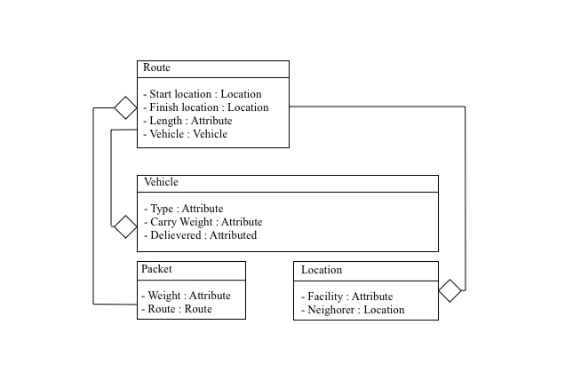
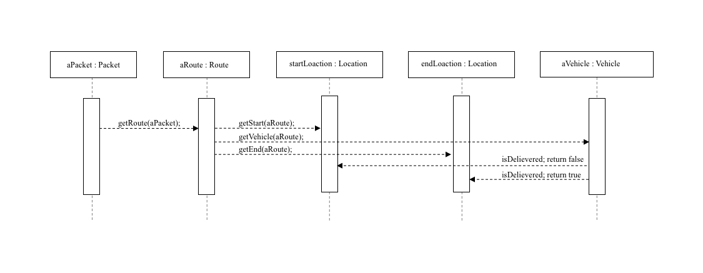

# Memo

__For Homework - 2__

_Haomin Shi_

# Project Overview

__Status:__ Complete

__Difficult part:__ Deploy, since no previous knowledge

__Work space tree:__

```bash
tree haomin-shi-HW-2/
haomin-shi-HW-2/
├── Homework_2
│   ├── build
│   │   ├── classes
│   │   │   └── java
│   │   │       ├── main
│   │   │       │   ├── A.class
│   │   │       │   ├── B.class
│   │   │       │   ├── C.class
│   │   │       │   ├── D.class
│   │   │       │   ├── E.class
│   │   │       │   ├── F.class
│   │   │       │   ├── ImporvedStringTokenizer.class
│   │   │       │   └── ImprovedRandom.class
│   │   │       └── test
│   │   │           ├── ATest.class
│   │   │           ├── BTest.class
│   │   │           ├── CTest.class
│   │   │           ├── DTest.class
│   │   │           ├── ETest.class
│   │   │           ├── FTest.class
│   │   │           ├── ImporvedStringTokenizerTest.class
│   │   │           └── ImprovedRandomTest.class
│   │   ├── libs
│   │   │   └── Homework_2-1.0.jar
│   │   ├── reports
│   │   │   └── tests
│   │   │       └── test
│   │   │           ├── classes
│   │   │           │   ├── ATest.html
│   │   │           │   ├── BTest.html
│   │   │           │   ├── CTest.html
│   │   │           │   ├── DTest.html
│   │   │           │   ├── ETest.html
│   │   │           │   ├── FTest.html
│   │   │           │   ├── ImporvedStringTokenizerTest.html
│   │   │           │   └── ImprovedRandomTest.html
│   │   │           ├── css
│   │   │           │   ├── base-style.css
│   │   │           │   └── style.css
│   │   │           ├── index.html
│   │   │           ├── js
│   │   │           │   └── report.js
│   │   │           └── packages
│   │   │               └── default-package.html
│   │   ├── test-results
│   │   │   └── test
│   │   │       ├── TEST-ATest.xml
│   │   │       ├── TEST-BTest.xml
│   │   │       ├── TEST-CTest.xml
│   │   │       ├── TEST-DTest.xml
│   │   │       ├── TEST-ETest.xml
│   │   │       ├── TEST-FTest.xml
│   │   │       ├── TEST-ImporvedStringTokenizerTest.xml
│   │   │       ├── TEST-ImprovedRandomTest.xml
│   │   │       └── binary
│   │   │           ├── output.bin
│   │   │           ├── output.bin.idx
│   │   │           └── results.bin
│   │   └── tmp
│   │       ├── compileJava
│   │       ├── compileTestJava
│   │       └── jar
│   │           └── MANIFEST.MF
│   ├── build.gradle
│   ├── gradle
│   │   └── wrapper
│   │       ├── gradle-wrapper.jar
│   │       └── gradle-wrapper.properties
│   ├── gradlew
│   ├── gradlew.bat
│   ├── out
│   │   ├── production
│   │   │   ├── Homework_2
│   │   │   └── classes
│   │   │       ├── A.class
│   │   │       ├── B.class
│   │   │       ├── C.class
│   │   │       ├── D.class
│   │   │       ├── E.class
│   │   │       ├── F.class
│   │   │       ├── ImporvedStringTokenizer.class
│   │   │       └── ImprovedRandom.class
│   │   └── test
│   │       └── classes
│   │           ├── ATest.class
│   │           ├── BTest.class
│   │           ├── CTest.class
│   │           ├── DTest.class
│   │           ├── ETest.class
│   │           ├── FTest.class
│   │           ├── ImporvedStringTokenizerTest.class
│   │           └── ImprovedRandomTest.class
│   ├── settings.gradle
│   └── src
│       ├── main
│       │   ├── java
│       │   │   ├── A.java
│       │   │   ├── B.java
│       │   │   ├── C.java
│       │   │   ├── D.java
│       │   │   ├── E.java
│       │   │   ├── F.java
│       │   │   ├── ImporvedStringTokenizer.java
│       │   │   └── ImprovedRandom.java
│       │   └── resources
│       └── test
│           ├── java
│           │   ├── ATest.java
│           │   ├── BTest.java
│           │   ├── CTest.java
│           │   ├── DTest.java
│           │   ├── ETest.java
│           │   ├── FTest.java
│           │   ├── ImporvedStringTokenizerTest.java
│           │   └── ImprovedRandomTest.java
│           └── resources
├── Memo.pdf
└── README.txt

36 directories, 82 files
```

### Problem 1:

> __Packets__ are sent from one __location__ to another. Packets have a certain __weight__. Locations are characterized by their __transportation facilities__, e.g. __railway stations, airports and highway connections__. Some locations are __neighbored__, i.e. there exists __a direct transportation route__ between these locations. The transportation route between the locations has a __certain length__, i.e. the __distance__ between the locations. __Planes, trains, and trucks are used for transportation__; each plane / train / truck may load __a maximum packet weight__. ___For each packet we want to know where it is, i.e. at which location or transport (plane, train, truck).___

__Imagine this:__

We have a class ```Packet``` that has ```Route```, and in ```Route``` we have:

> ```startLocation:Location```,	```endLocation:Location```,```length```, and ```Vehicle```

In ```Vehicle``` we have:

> ```type```, ```carryWeight```, and ```Delievered:boolean```

Now, based on the questionL Suppose we want to know __ where a package is currently at, and at what location by what transport?__ all we need is to do this:

```java
aPacket.getRoute().getVehicle; //Return Type of Vehicle
if (aPacket.getRoute().getVehicle.isDelievered(); // Return Packet at End Location
if (!aPacket.getRoute().getVehicle.isDelievered()); // Return Packet at Start Location
```

- Class Diagram
  - 

- Sequence diagram
  - 

### Problem 2:

The solution of this problem is provided in the ```src```

### Problem 3:

[**Integer**](http://docs.oracle.com/javase/8/docs/api/index.html) is part of the Java API. Suppose you attempt to extend the Integer class and add a new method that returns the integer as a String that is written in hexadecimal.

1. The reason why we cannot extend the Integer class is that the class itself is defined as final, that is = you cannot inherit the class.
2. Some people argue that this is to prevent an "Inheritance Chain of Doom". However, In Java, we cannot do multi-inheritance. Thus, this is not a good reason to NOT allow inheritance. Meanwhile, to declare a class final, we basically gave up __1__ big chunk of __OOP__ that is __Polymophism__. We can argue that the reason people do this to have better __Encapsolation__, but I don't think this reason is sufficient enough. However, here are some of the more interesting reasons why we want to ```final``` our class:
   - Encouraging composition
   - Public API protection
     - Avoid change in API causing Client Code to break
   - Encapsulation
3. It is possible for us to create a __wrapper__ class that takes care of the integer. Say, for example, we want to include the __square root of itself__ to Integer. What we can do is to create a class called ```IntegerWrapper``` and in the constructor of that class, we can create a ```Integer``` by user's argument. Then we can implement ```squareRoot``` in this ```IntegerWrapper``` class that uses the ```Integer``` obj that we create in the constructor.

### Problem 4:

The solution of this problem is provided in the ```src```

### Problem 5:

The solution of this problem is provided in the ```src```

---

### Appendix

1. **Complexity: By methods**

| A.A(B)                                                       | 1.0  | 1.0               | 1.0               |
| ------------------------------------------------------------ | :--: | ----------------- | :---------------- |
| A.getInfoAboutClass()                                        | 1.0  | 1.0               | 1.0               |
| A.returnBinfo()                                              | 1.0  | 1.0               | 1.0               |
| B.B()                                                        | 1.0  | 1.0               | 1.0               |
| B.getEditable()                                              | 1.0  | 1.0               | 1.0               |
| B.getInfoAboutClass()                                        | 1.0  | 1.0               | 1.0               |
| B.setEditable(String)                                        | 1.0  | 1.0               | 1.0               |
| C.C(B,D)                                                     | 1.0  | 1.0               | 1.0               |
| C.getInfoAboutClass()                                        | 1.0  | 1.0               | 1.0               |
| C.returnDinfo()                                              | 1.0  | 1.0               | 1.0               |
| D.D()                                                        | 1.0  | 1.0               | 1.0               |
| D.getEditable()                                              | 1.0  | 1.0               | 1.0               |
| D.getInfoAboutClass()                                        | 1.0  | 1.0               | 1.0               |
| D.instanceCounter()                                          | 1.0  | 2.0               | 2.0               |
| D.setEditable(String)                                        | 1.0  | 1.0               | 1.0               |
| E.E(B,D)                                                     | 1.0  | 1.0               | 1.0               |
| E.getInfoAboutClass()                                        | 1.0  | 1.0               | 1.0               |
| E.returnBinfo()                                              | 1.0  | 1.0               | 1.0               |
| E.returnDinfo()                                              | 1.0  | 1.0               | 1.0               |
| F.F(D)                                                       | 1.0  | 1.0               | 1.0               |
| F.getInfoAboutClass()                                        | 1.0  | 1.0               | 1.0               |
| F.instanceCounter()                                          | 1.0  | 2.0               | 2.0               |
| ImporvedStringTokenizer.ImporvedStringTokenizer(String)      | 1.0  | 1.0               | 1.0               |
| ImporvedStringTokenizer.ImporvedStringTokenizer(String,String) | 1.0  | 1.0               | 1.0               |
| ImporvedStringTokenizer.ImporvedStringTokenizer(String,String,boolean) | 1.0  | 1.0               | 1.0               |
| ImporvedStringTokenizer.toArray()                            | 1.0  | 1.0               | 1.0               |
| ImprovedRandom.ImprovedRandom()                              | 1.0  | 1.0               | 1.0               |
| ImprovedRandom.ImprovedRandom(long)                          | 1.0  | 1.0               | 1.0               |
| ImprovedRandom.randIntInRange(int,int)                       | 1.0  | 2.0               | 2.0               |
| Total                                                        | 29.0 | 32.0              | 32.0              |
| Average                                                      | 1.0  | 1.103448275862069 | 1.103448275862069 |

2. **Lines of Code:**

| Total: | 423   | 314         | 0.7423167848699763 | 24      | 0.05673758865248227 | 85    | 0.20094562647754138 |
| ------ | ----- | ----------- | ------------------ | ------- | ------------------- | ----- | ------------------- |
|        | Lines | Source Code | Source / Total     | Comment | Comment / Total     | Blank | Blank / Total       |

3. **Unit Test Coverage:**

| A                       | 100% (1/1) | 100% (3/3) | 100% (6/6)   |
| ----------------------- | ---------- | ---------- | ------------ |
| B                       | 100% (1/1) | 100% (4/4) | 100% (7/7)   |
| C                       | 100% (1/1) | 100% (3/3) | 100% (7/7)   |
| D                       | 100% (1/1) | 100% (5/5) | 100% (16/16) |
| E                       | 100% (1/1) | 100% (4/4) | 100% (7/7)   |
| F                       | 100% (1/1) | 100% (3/3) | 100% (10/10) |
| ImporvedStringTokenizer | 100% (1/1) | 50% (2/4)  | 40% (4/10)   |
| ImprovedRandom          | 100% (1/1) | 100% (3/3) | 100% (7/7)   |